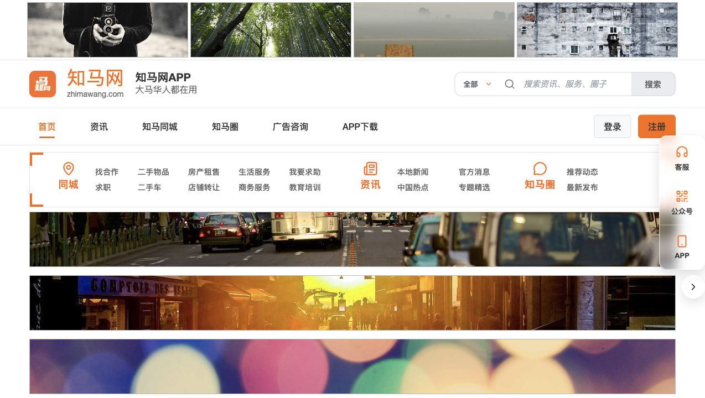

# Zhima Web Frontend

面向马来西亚华人群体的信息与社区平台前端，覆盖新闻资讯、便民服务、生活分享、活动、商家与用户中心等模块。

## Screenshot



## 技术栈

- Vue 3, Vite
- Element Plus, Pinia, Vue Router
- Axios, Day.js, QRCode
- Sass, ESLint, Prettier

## 本地运行

```bash
npm install
npm run dev
```

## 构建

```bash
npm run build
npm run preview
```

## 目录

- `src/`: 前端源码
- `src/api/`: API 封装
- `src/views/`: 页面
- `src/components/`: 公共组件
- `docs/`: API 与功能文档
- `disk/`: 静态原型和资源

## 备注

真实接口、账号和生产配置不要提交到仓库；只保留示例或文档说明。
